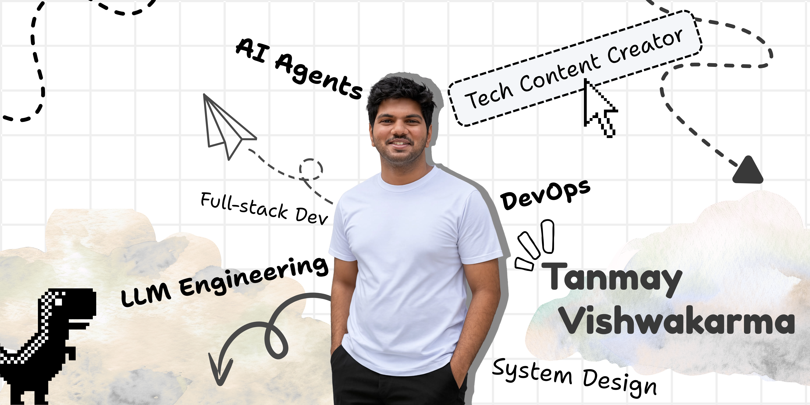
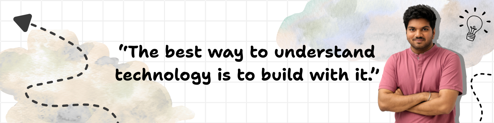

  

###

  

###

<h1 data-importer="text" align="center">Hey, I'm Tanmay Vishwakarma</h1>

###

<h3 data-importer="text" align="center">Building intelligent systems by combining AI, software engineering, and modern infrastructure 🚀</h3>

###

I'm a Computer Engineering student at Sardar Patel Institute of Technology (SPIT), Mumbai, exploring the intersection of LLM Engineering, Full-Stack Development, and DevOps.

###

I enjoy building systems end-to-end - from designing user-friendly interfaces and scalable backend services to experimenting with AI agents, retrieval systems, and cloud-native architectures.

###

Currently, I am focused on:  - 🤖 Building LLM-powered applications and AI agents - 🧠 Exploring Agentic AI, RAG systems, and LLM workflows - 🌐 Developing full-stack applications - ⚙️ Understanding DevOps, containers, and infrastructure

###

  

###

<h2 data-importer="text" align="left">🧠 AI / LLM Engineering</h2>

###

Building and experimenting with:  - Large Language Model applications - Tool-using AI agents - Agentic workflows - Retrieval-based systems - Multi-step reasoning pipelines

###

  
  
  
  
  
  
  

###

<h2 data-importer="text" align="left">🌐 Full-Stack Development</h2>

###

Building production-style applications with modern frontend, backend, authentication, and database architectures.

###

  
  
  
  
  
  
  
  
  
  
  
  
  
  
  
  
  
  
  
  
  
  
  
  
  
  
  

###

<h2 data-importer="text" align="left">⚙️ DevOps & Infrastructure</h2>

###

Currently learning how applications move from development to production.  Exploring:

###

  
  
  
  
  
  
  
  
  
  
  
  
  
  
  

###

<h2 data-importer="text" align="center">📚 Beyond Coding</h2>

###

Apart from building projects, I enjoy:  - Sharing technical content on LinkedIn - Simplifying complex engineering concepts - Attending tech communities and hackathons - Exploring new areas of computer science

###

<h3 data-importer="text" align="left">Topics I write about:</h3>

###

<h3 data-importer="text" align="center">LLMs | AI Agents | System Design | Cloud | DevOps</h3>

###

  

###

  

###

  

###
